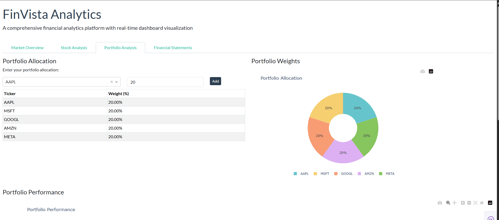

# FinVista Analytics

A comprehensive financial analytics platform with real-time dashboard visualization, integrating multiple data sources for predictive modeling.

## [Live Demo](https://finvista-analytics.onrender.com/)

## Features

- **Interactive Dashboards**: Real-time visualization of financial data
- **Technical Analysis**: Candlestick charts, moving averages, RSI, MACD, Bollinger Bands
- **Portfolio Analysis**: Performance metrics, risk assessment, correlation analysis
- **Stock Comparison**: Compare multiple stocks with normalized price charts
- **Financial Statements**: View and analyze income statements, balance sheets, and cash flow statements
- **Price Forecasting**: Monte Carlo simulation for price predictions

## Screenshots

## Tech Stack

- **Frontend**: Dash, Plotly, Bootstrap
- **Backend**: Python, Pandas, NumPy
- **Data Sources**: Yahoo Finance API
- **Deployment**: Render

## Project Structure

FinVista-Analytics/

├── data/                  # Data storage

├── finvista/              # Core package

│   ├── data_loader.py     # Data loading functions

│   ├── data_processor.py  # Data processing and analysis
│   ├── visualizations.py  # Visualization components
│   └── models.py          # Financial models
└── app.py                 # Main dashboard application

## How It Works

The dashboard fetches financial data from various sources, processes it with custom algorithms, and presents interactive visualizations. Users can analyze stocks, compare performance, and build portfolios.

## License

This project is made available as a portfolio showcase. The code in this public repository is provided for demonstration purposes only and may not be used for commercial or derivative works without permission.

Copyright (c) 2025 Bhagyashree Jena
